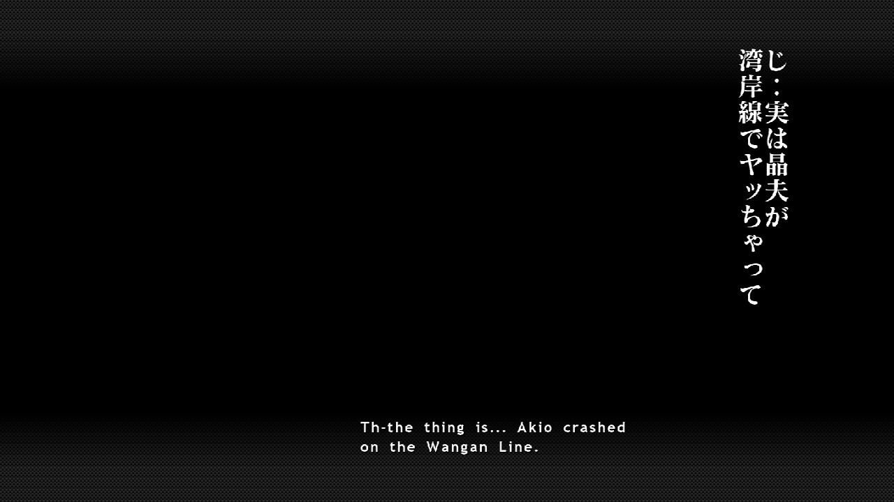
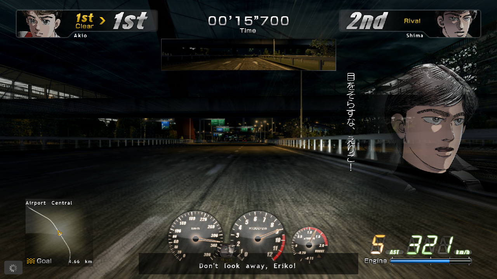
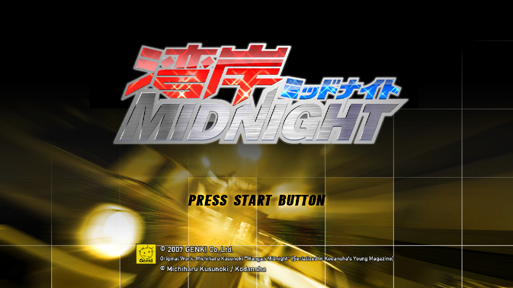
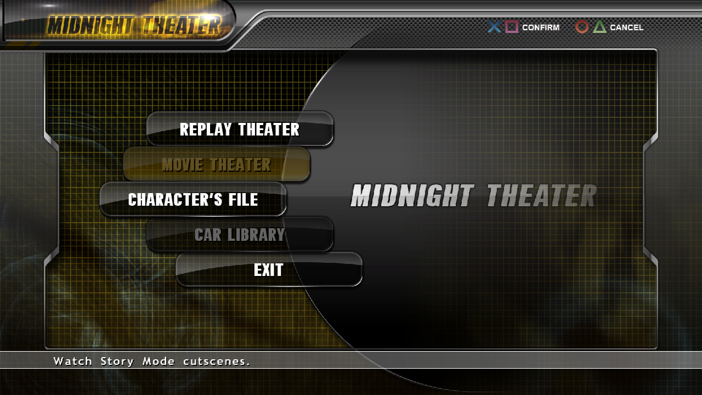
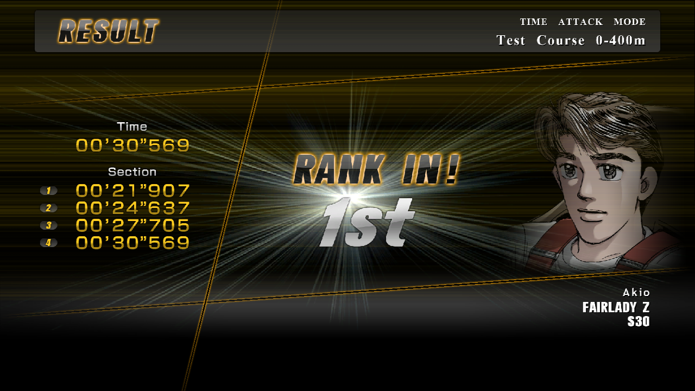
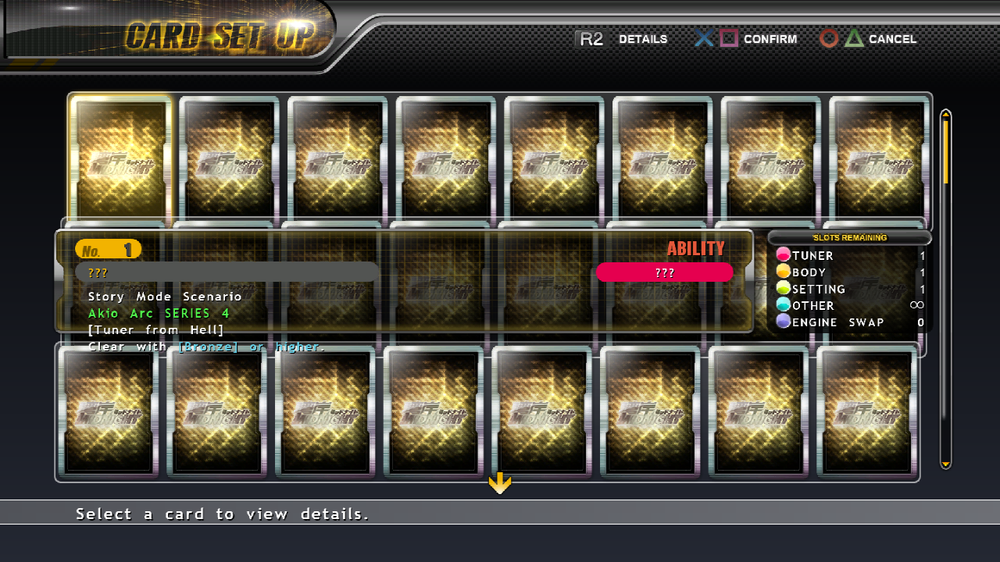

# 🏁🌃 Wangan Midnight (PS3) — English Patch!

Ever wanted to race the Devil Z down the Wangan in **Wangan Midnight** (湾岸ミッドナイト), Genki's 2007 PlayStation 3 street-racing game based on Michiharu Kusunoki's manga, and actually understand what everyone's saying? Now you can! 🎉

The menus, the story and the on-screen text are all in English. 🇬🇧 (The voice acting and videos are still in Japanese.)

| | |
|---|---|
| 🎮 **Platform** | Sony PlayStation 3 |
| 💿 **Serial** | BLJM60028 (Japan), disc version 01.02 |
| 🩹 **Patch format** | xdelta3, applied to `WMN.DAT` and `WMN.TOC` (+ an optional patch for `EBOOT.BIN`) |
| 🧪 **Tested on** | RPCS3 |
| 🚧 **Status** | v0.6.0 beta |
| ⬇️ **Download** | grab it from [**Releases**](../../releases) |

---

## 📸 Screenshots

| 🎞️ Story cutscene | 💬 Race cut-in | 🏁 Title screen |
|:---:|:---:|:---:|
|  |  |  |
| 🎬 **Midnight Theater** | 🏆 **Results** | 🃏 **Card View** |
|  |  |  |

*Taken from the patched game in RPCS3.*

---

## ✅ What's translated

- 📋 **All the menus**: title, main menu, Story Mode, Time Attack, Free Run, One Match, options, save and install dialogs, the pause menu
- 📖 **Story Mode**: scenario and series select, the series synopses and the comic cutscene dialogue
- 🎞️ **The story cutscenes** (photo and comic): the original vertical Japanese text stays as part of the art, and an **English subtitle** appears at the bottom of the screen
- 💬 **In-race cut-ins**: the original vertical Japanese stays next to the portrait, with an **English subtitle** on a dark box at the bottom of the screen
- 🏁 **Racing**: the HUD, mission banners, loading tips, road signs, results and the retry screen
- 🃏 **Card Set Up**: menus, card details and the card faces
- 🎬 **Midnight Theater**: every **Character File** biography and **Car Library** entry
- 🎨 **Graphics redrawn in English**: button prompts, character name badges, arc and episode title cards, the rival title cards (car + driver), status badges, the boot notices and the title-screen copyright
- 💾 **Save data labels** on the save/load screen, plus the test-course names and online prompts, with the optional `EBOOT.BIN` patch
- 🔤 **A new English font** with proportional letter spacing
- 🧑 **Character names** follow the English names used by fans of the manga and anime
- 🗣️ **The English follows the anime's English subtitles**: -san / -kun / -chan where the Japanese has them, "the Devil Z", "the Wangan", Kitami calling Reina "missy"

### 🇯🇵 Still in Japanese

- 🎙️ The voice acting
- 🎬 The videos
- 🎞️ The vertical text in the story cutscenes and in-race cut-ins, on purpose (it has an English subtitle)

---

## 📦 What you need

The Japanese disc **BLJM60028, version 01.02**, dumped as a game folder (`PS3_GAME` + `PS3_DISC.SFB`). Two files in `PS3_GAME\USRDIR\PS3\` get patched, plus (optionally) `EBOOT.BIN`:

| File | Size (bytes) | CRC32 | MD5 |
|---|---|---|---|
| `WMN.DAT` | 914,235,392 | `d41ab9c3` | `1459fb12e07831370eab5cf2fce9b491` |
| `WMN.TOC` | 229,192 | `5cc1f15a` | `8f775d3d521236b28ef3f0627ab39306` |

SHA-1 of `WMN.DAT`: `7031528a066bc8f3b59deddc7531b8d334f55437`

👉 Patch from the **original Japanese files** (not from v0.5.0).

A few things live inside `EBOOT.BIN`, the game program: the save data labels, two test-course names, the online prompts, and the code that puts the vertical Japanese back in the in-race cut-ins. The optional `EBOOT.BIN` patch covers those. `EBOOT.BIN` is encrypted on the disc, so the patch applies to the copy **you decrypt yourself in RPCS3** (step 5 below), which must be 9,306,832 bytes, MD5 `28e42cb6468bde0586783a21a198fcc4`. Without it, those few lines stay Japanese and the cut-ins show the English subtitle alone.

> ⚠️ This repo contains **only patch files**. No game data is included, so you need your own copy of the game.

---

## 🛠️ How to apply

1. 💾 **Back up** your `WMN.DAT` and `WMN.TOC` first!
2. 🩹 Apply each `.xdelta` to its file with any xdelta3 tool:
- 🪟 **Windows app:** [Delta Patcher](https://github.com/marco-calautti/DeltaPatcher) or xdeltaUI
- 🌐 **In your browser:** [Rom Patcher JS](https://www.marcrobledo.com/RomPatcher.js/) (the 900 MB `WMN.DAT` may be too big for some browsers; use a desktop tool if it fails)
- 💻 **Command line:**
```
xdelta3 -d -s "original WMN.DAT" "Wangan Midnight - English v0.6.0 (WMN.DAT).xdelta" "WMN.DAT"
xdelta3 -d -s "original WMN.TOC" "Wangan Midnight - English v0.6.0 (WMN.TOC).xdelta" "WMN.TOC"
```
3. 📝 Put the two patched files back in `PS3_GAME\USRDIR\PS3\` **under their original names**.
4. 🎮 Boot `PS3_GAME\USRDIR\EBOOT.BIN` in RPCS3, or copy the game folder to a PS3 running custom firmware / HEN and start it from webMAN or multiMAN.
5. 🧩 *Optional, `EBOOT.BIN`:* in RPCS3 choose **Utilities > Decrypt PS3 Binaries** and pick your original `PS3_GAME\USRDIR\EBOOT.BIN`. RPCS3 writes the decrypted program as an `.elf` file. Apply `Wangan Midnight - English v0.6.0 (EBOOT.BIN).xdelta` to that file and put the result in `PS3_GAME\USRDIR\` as `EBOOT.BIN` (keep a backup of the original). RPCS3 runs it as it is; a real PS3 needs it re-signed first, or just keep your original `EBOOT.BIN`. The save labels turn English the next time the game creates its save.

### 🔍 Check your result

| File | Size (bytes) | CRC32 | MD5 |
|---|---|---|---|
| Patched `WMN.DAT` | 912,623,616 | `1462eeb3` | `f26a2aec567538bafaeb6a1fd773bb99` |
| Patched `WMN.TOC` | 229,192 | `6c611958` | `beff83bc56ba7bc253e166801176d70e` |
| Patched `EBOOT.BIN` | 9,306,832 | `a117b1b9` | `4013e966b45808e31e9b3d0e302f2d72` |
| Patch file (`WMN.DAT`) | 26,413,592 | `39e601d8` | `9c20c3ce00e5c0f7b2b9abf4d3754a20` |
| Patch file (`WMN.TOC`) | 13,336 | `7a1494c2` | `8aed1486c16099597af1e9be5e541c31` |
| Patch file (`EBOOT.BIN`) | 393 | `9ec97121` | `ad553f249bcecb49c360e75e2820b505` |

SHA-1 of the patched `WMN.DAT`: `942ae1cbd0c1cf557202f8e92313c4c1f7274b6d`

📏 The patched `WMN.DAT` is **1,611,776 bytes smaller** than the original. That's expected, don't worry!

❌ If the patcher complains about a checksum or source mismatch, your files aren't from the 01.02 disc listed above.

---

## 🚧 Known limits (v0.6.0 beta)

- 🖥️ Tested on emulator (RPCS3) only. It hasn't been tried on real PS3 hardware yet. A real PS3 needs the patched `EBOOT.BIN` re-signed; with the original one the few `EBOOT.BIN` lines stay Japanese.
- 👀 Not checked on screen yet: story cutscenes past the opening of each arc, the Character File and Car Library entries (they unlock as you play), a cut-in with the portrait on the right, Survival mode, and online mode (Wangan Connection).
- 💬 In the camera view with the gauges at the bottom center, the gauges cover part of the cut-in subtitle.
- 🤏 The title-screen copyright line is correct but small.

Found something still in Japanese, or text that runs off the screen? Open an [issue](../../issues) with a screenshot! 🙏

---

## 🤓 Technical notes

- 🗂️ All the game's text and graphics live in one big archive (`WMN.DAT`, indexed by `WMN.TOC`). The patch rebuilds that archive. A rebuild with no changes reproduces the original archive byte for byte.
- 🔤 Text is stored as plain Shift-JIS, and English lines are broken by hand, since the game doesn't wrap text by itself. The font atlases got new Latin letters and a proportional width table.
- 🎞️ The story cutscenes (photo and comic) draw some text vertically. Each vertical line keeps its Japanese, and the cutscene script gets an extra call that shows the English line in the game's own horizontal subtitle box.
- 🧩 The handful of strings stored in `EBOOT.BIN` are replaced in the decrypted program, along with 17 instructions so the cut-in text is written to two text boxes instead of one. The patch file holds only those changed bytes, no game code.
- 💬 The race cut-in scene file gets a second text box and a dark backing box: one box keeps the original vertical Japanese, the other shows the English as a horizontal subtitle.
- 🧰 Everything was rebuilt with custom tools: archive repacking, text tables, scene-graph text, texture injection (DXT) and cutscene script patching.

---

## ⚖️ Disclaimer

This is an unofficial, non-commercial fan project ❤️. It is not affiliated with or endorsed by Genki, Kodansha, or the original author, Michiharu Kusunoki. *Wangan Midnight* and all related characters and marks belong to their respective owners. Please support the official releases! 🙏

🤖 **AI assistance:** AI tools helped with parts of this project.
